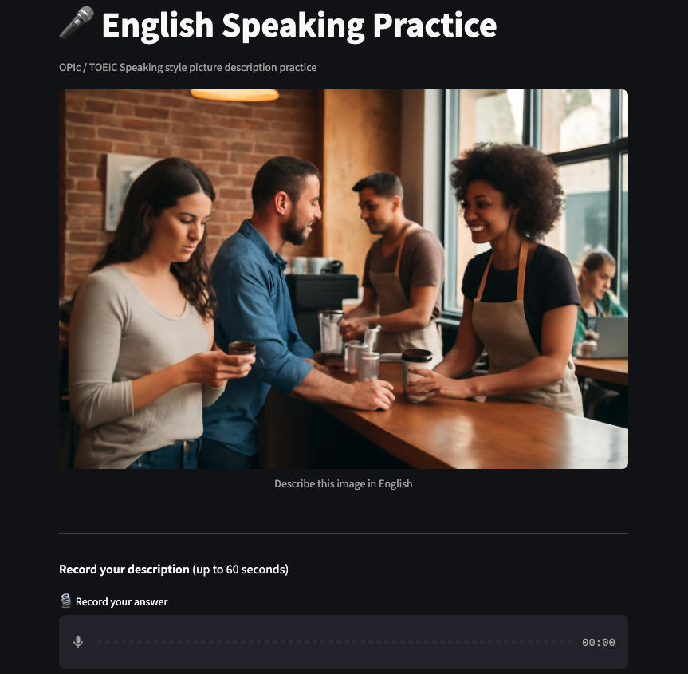

# English speaking practice Agent

OPIc / TOEIC Speaking picture description practice app

- LangGraph pipeline + Streamlit UI
- Record voice → Transcribe → Correct → Recommend ideal answer

---

# Graph Overview

<!-- column_layout: [1, 2] -->

<!-- column: 0 -->

<!-- column: 1 -->

**generate_image**: GPT Image generates a daily scene

**record_voice**: pauses graph, user records via Streamlit

**transcribe**: Whisper converts speech to text

- 2x speed-up by modifying WAV sample rate header

**search_references**: Tips and grading criteria by API(Tavily) tool

**correct_syntax**: grammar, vocabulary, structure fixes

**recommend_ideal_answer**: vision model writes ideal answer

**ask_regenerate**: user decides to loop or finish

<!-- reset_layout -->

---

# Product demo

- [https://to-be-frank.streamlit.app]

<!-- reset_layout -->

---

# Planned improvements

- Cache images & transcriptions to cut token cost and speed up responses
- Let users pick a scene category (cafe, office, park, airport, etc.)
- Let users choose answer length and difficulty (30s/45s/60s, beginner to advanced)

---

# Thank You
