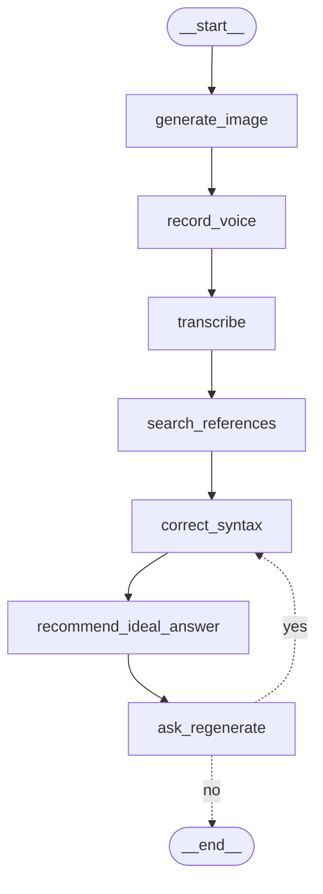

# English Speaking Practice

OPIc / TOEIC Speaking picture description practice app

- LangGraph pipeline + Streamlit UI
- Record voice → Transcribe → Correct → Recommend ideal answer

---

# Pipeline



---

# Nodes

<!-- column_layout: [1, 1] -->

<!-- column: 0 -->

| Node              | API            |
| ----------------- | -------------- |
| generate_image    | `gpt-image-1`  |
| record_voice      | `interrupt()`  |
| transcribe        | `whisper-1`    |
| search_references | `TavilySearch` |

<!-- column: 1 -->

| Node                   | API                    |
| ---------------------- | ---------------------- |
| correct_syntax         | `gpt-4o-mini`          |
| recommend_ideal_answer | `gpt-4o-mini` (vision) |
| ask_regenerate         | `interrupt()`          |

<!-- reset_layout -->

---

# Key Patterns

- **Prompt Chaining** — sequential node execution
- **Human-in-the-loop** — `interrupt()` for voice input & regeneration
- **Conditional Loop** — `ask_regenerate` routes back to `correct_syntax`
- **Tool Integration** — Tavily web search for scoring rubrics

<!-- pause -->

**State accumulation** via `Annotated[list, operator.add]`

```python
corrections: Annotated[list[str], operator.add]
recommendations: Annotated[list[str], operator.add]
```

---

# Thank You
